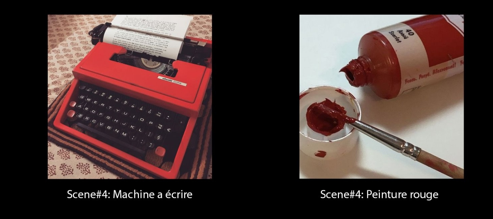

# Compétences
Cochez les compétences que vous aimeriez utiliser en stage. Ajoutez-en au besoin.:     
- [ ] Designer, coder et publier des sites Web dynamiques    
- [x] Réaliser et tourner des vidéos    
- [x] Animer des créations 2D et 3D    
- [x] Concevoir des compositions sonores et visuelles interactives    
- [ ] Assembler des environnements de réalité virtuelle    
- [ ] Élaborer des spectacles augmentés    
- [ ] Exploiter les nouvelles technologies et leur potentiel créateur    
- [ ] Penser et optimiser l’expérience utilisateur    
- [x] Créer des univers immersifs et interactifs    
- [x] Collaborer avec diverses disciplines artistiques ou interdisciplinaires    

# Logiciels 
Cochez les logiciels avec lesquels vous êtes à l'aise. Ajoutez-en au besoin.:     
- [x] Visual Studio Code
- [x] Photoshop
- [ ] Illustrator
- [ ] Lightroom
- [ ] Premiere
- [ ] Media Encoder
- [x] After Effects
- [x] Davinci Resolve
- [x] Maya
- [ ] Unity
- [x] Reaper
- [ ] Ableton Live
- [ ] Max
- [ ] Arduino
- [ ] MadMapper
- [x] Microsoft Teams

# Langage de programmation
Cochez les langages avec lesquels vous êtes à l'aise. Ajoutez-en au besoin.:    
- [x] HTML
- [x] CSS
- [ ] JavaScript
- [ ] PHP
- [ ] SQL
- [ ] C# (Unity)
- [ ] C++ (Arduino)
- [ ] Connaissance de systèmes de gestion de contenu (CMS)

# Objectif de carrière
Copier-coller votre objectif de carrière ici. 

# Projet 1 
Nom de votre projet: Pixar    
Réalisé dans le cadre du cours: Animation 3D   
Individuel ou en équipe: Individuel
Votre ou vos rôle(s) dans le projet: Animateur et modélisateur  
Logiciels ou techniques utilisées: Maya, Davinci Resolve 
Catégorie du projet: Animation 3D    
Description courte du projet (Résumé en 1 phrase): Pixar est un projet qui a pour intention de recréer et de réimaginer de manière créative la célèbre animation de Pixar
Description du projet (Qu'est-ce que le prof vous a demandé de réaliser?) (2 phrases): Créer une imitation de l’animation de la lampe Pixar, dans la vidéo d’introduction de leurs films, en utilisant une ou des formes géométriques avec un rig simple pour imiter la lampe 
Description de votre projet (Qu'est-ce que vous avez fait?) (2 phrases): J’ai modélisé le bonbon principal ainsi que les lettres. J’ai aussi tout animé, ajouté la colorisation et intégré la musique.
Lien vers la documentation de votre projet (photos, vidéos, extraits sonores, ...):     

# Projet 2 
Nom de votre projet: Imparfaite  
Mention académique ou personnel: Meilleure Vidéo de la classe et gagner le prix du coucour audio-visuelle 
Réalisé dans le cadre du cours: Vidéo 2    
Individuel ou en équipe: en équipe 
Nom de vos coéquipiers: Nurlika Richard et Sarah Muller Francois
Votre ou vos rôle(s) dans le projet: Actrice Monteuse Vidéo et Trame sonore
Logiciels ou techniques utilisées: Davinci Resolve
Catégorie du projet: Vidéo
Description courte du projet (Résumé en 1 phrase): Ce projet a pour but de raconter l'histoire d'une jeune fille mal à l'aise dans sa peau grâce à une lentille micro.
Description du projet (Qu'est-ce que le prof vous a demandé de réaliser?) (2 phrases):  Créer une vidéo sur le corps humain où l’accumulation d’images exprime un sentiment ou raconte une histoire en 1 minute 30.
Description de votre projet (Qu'est-ce que vous avez fait?) (2 phrases): J'ai trier les médias, j'ai fait le montage, la colorisation ainsi que le son    
Lien vers la documentation de votre projet (photos, vidéos, extraits sonores, ...):     

# Projet 3 
Nom de votre projet: Un monde Inconnu 
Mention académique ou personnel: 
Réalisé dans le cadre du cours: Vidéo 1       
Individuel ou en équipe: en équipe 
Nom de vos coéquipiers: Nurlika Richard et Sarah Muller Francois   
Votre ou vos rôle(s) dans le projet: Actrice Monteuse Vidéo et Trame sonore  
Logiciels ou techniques utilisées: Davinci Resolve   
Catégorie du projet: Vidéo     
Description courte du projet (Résumé en 1 phrase): Un monde inconnu présente un personnage inanimé qui prend vie et qui découvre le monde autour de lui 
Description du projet (Qu'est-ce que le prof vous a demandé de réaliser?) (2 phrases): Créer une vidéo de 1 minute style stop motion et l'accompagner avec un micro-montage
Description de votre projet (Qu'est-ce que vous avez fait?) (2 phrases):   J'ai trier les médias, j'ai fait le montage, la colorisation ainsi que le micro-montage  
Lien vers la documentation de votre projet (photos, vidéos, extraits sonores, ...):     

# Projet 4
Nom de votre projet: Monde a l'envers   
Mention académique ou personnel:     
Réalisé dans le cadre du cours: Animation 3D     
Individuel ou en équipe: Indiviudel       
Votre ou vos rôle(s) dans le projet: Animatrice et Monteuse    
Logiciels ou techniques utilisées: Maya et Davinci Resolve   
Catégorie du projet: Animation 3D
Description courte du projet (Résumé en 1 phrase): Ce projet représente un monde parallèle, un monde causé par une drogue psychédélique, une distorsion de la réalité
Description du projet (Qu'est-ce que le prof vous a demandé de réaliser?) (2 phrases): Réalisation d’un environnement 3D et de plusieurs séquences d’animation autour du même thème. 
Description de votre projet (Qu'est-ce que vous avez fait?) (2 phrases): J'ai modéliser certaines choses, J'ai tout animer, j'ai fait le montage vidéo ainsi que la bande sonore    
Lien vers la documentation de votre projet (photos, vidéos, extraits sonores, ...):     
 
Sélectionnez un de vos projets et insérez son processus de création. À l'aide d'images et de texte vous devez nous expliquer le processus de création étape par étape de votre projet. 
# Processus de Imparfaite : 
# Inspiration:

### Moodboard

Un monde inconnu se dévoile dans une atmosphère chaleureuse et empreinte de curiosité. Ce projet vise à illustrer la découverte et l'aventure d'un personnage qui prend vie. L'esthétique de ce monde inconnu s'inspire du style d'animation caractéristique de films tels que Coraline, Fantastic Mr. Fox, et du court métrage Gruff, mais trouve surtout son inspiration dans le stop motion "Delivered" de Vincent René Lortie.

### Colorisation

Dans Un Monde Inconnu, tous les décors sont vintage. La palette de couleurs tourne autour de différentes nuances de rouges. Au niveau des décors, on utilise un style monochrome, que ce soit avec la lumière ou la décoration.

### Accesoires

### Horaire de tournage

